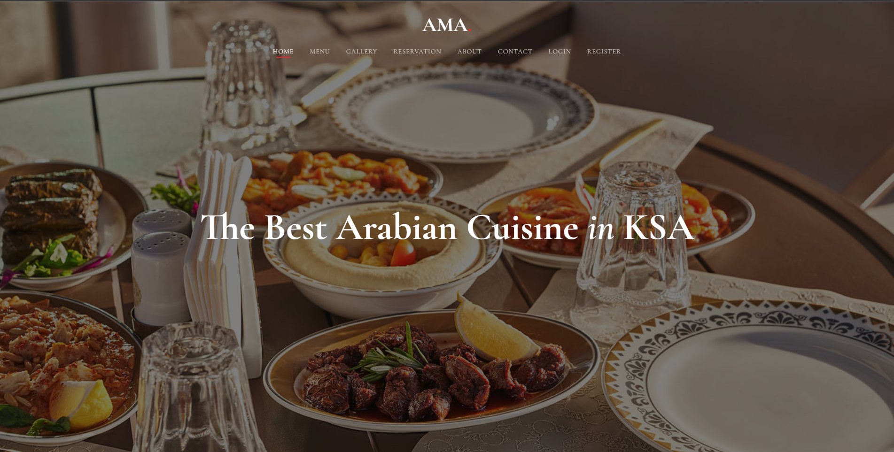
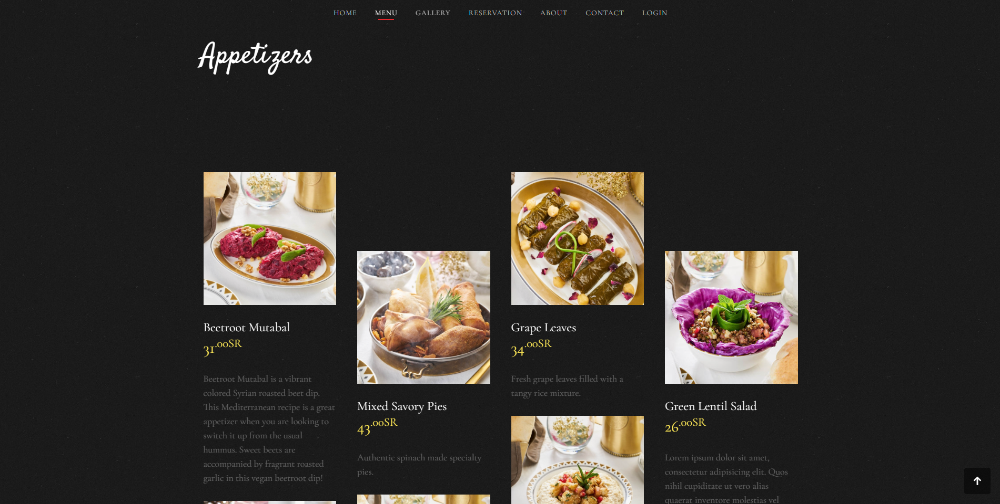
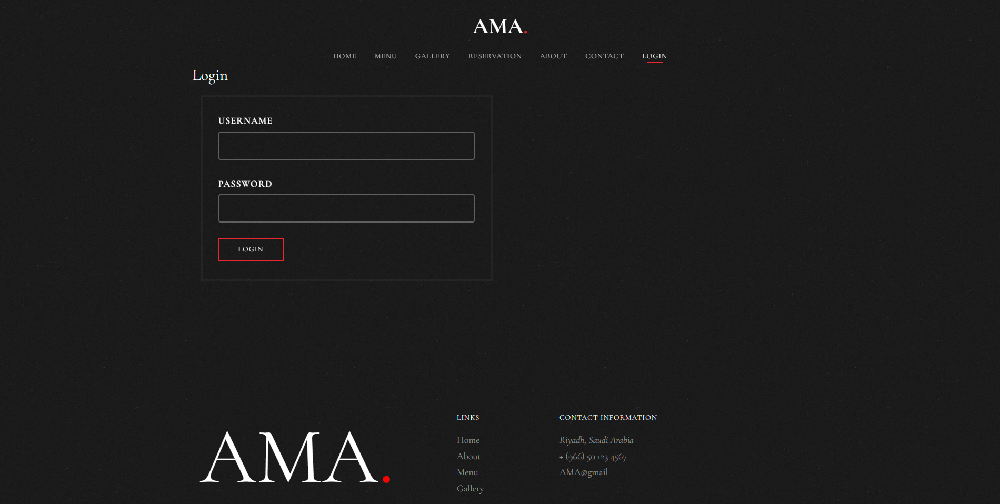
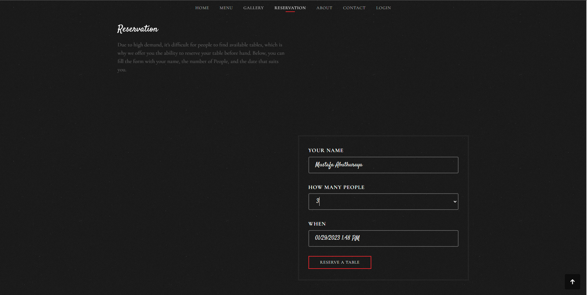
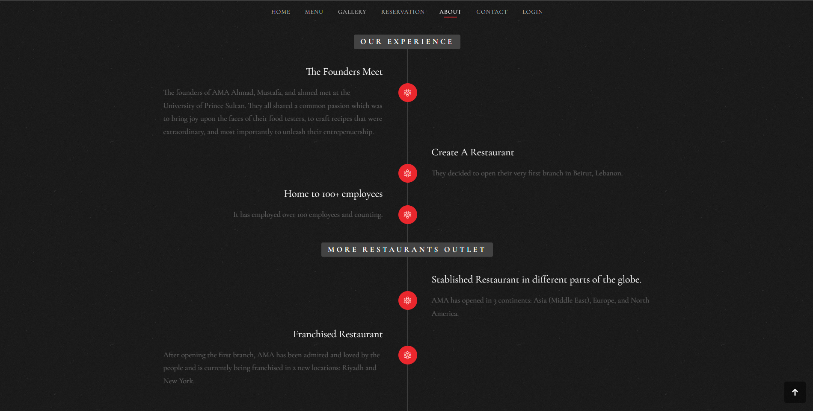

# Restaurant App - AMA (Sep. 2020 - Dec. 2020)

A restaurant app that allows you to browse menu items, login, register, and book reservations in our restaurant, AMA.

## Collaboration
Collaborated and worked as a developer in a team of 3 to build a full-stack Web-app

## Technology Stack
- Front-end: HTML, CSS, JavaScript
- Back-end: PHP, SQL, XAMPP

## Features
- Browse menu items
- Login and Register
- Book Reservations

## Screenshot Demo

<h3 align="center">  Home </h3>

<h3 align="center">  Menu </h3>

<h3 align="center">  Login </h3>

<h3 align="center">  Reservation </h3>

<h3 align="center">  About </h3>

